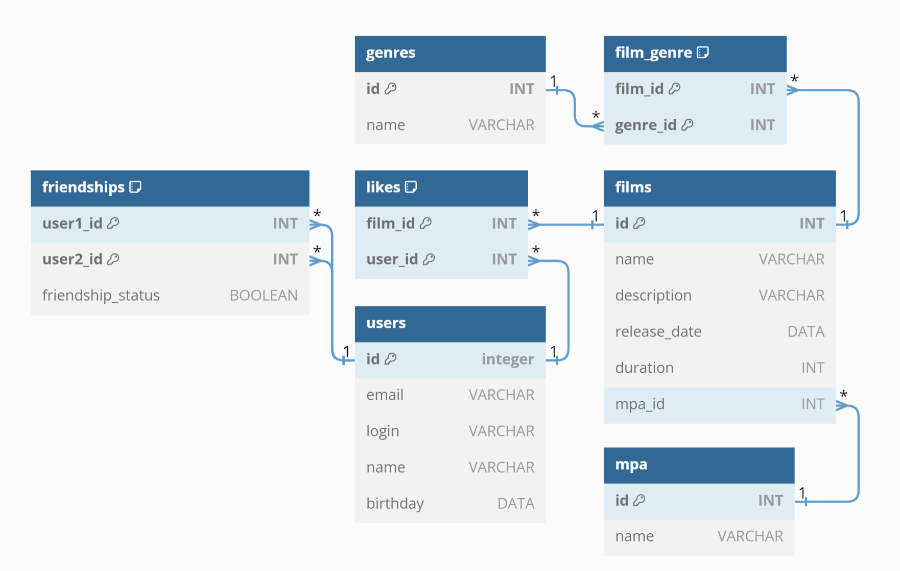

# Filmorate
### Учебный проект "Рейтинг фильмов" был разработан на Java с использованием фреймворка Spring Boot и JDBC. 
В проекте было выполнено несколько технических заданий, которые позволили изучить различные аспекты разработки приложений.

Задание 1: Создание каркаса Spring Boot приложения.

В рамках этого задания была создана базовая структура приложения. Включая настройку проекта, создание 
контроллеров и сущностей, а также реализацию базового API, для работы с данными о фильмах и пользователях. 
Для хранения данных использовалась типовая коллекция Map из фреймворка Java Collection.

Задание 2: Работа над архитектурой проекта.

Во втором задании была проработана архитектура приложения. Были добавлены новые слои и зависимости между ними. 
Слой сервисов для реализации бизнес-логики приложения, слой репозитория для работы с базой данных на основе 
коллекции Map. Также был добавлен слой DTO для передачи данных между слоями приложения с использованием библиотеки 
MapStruct. В проект также был добавлен javadoc для документирования кода.

Задание 3: Перенос базы данных на реляционную DB.

В третьем задании были добавлены новые реализации интерфейсов репозиторного слоя для работы с реляционной
базой данных H2. Были реализованы методы для взаимодействия с DB через SQL-запросы и JDBCTemplate.
Так же в проект был добавлен новый функционал и новые сущности.

## ER-диаграмма базы данных

