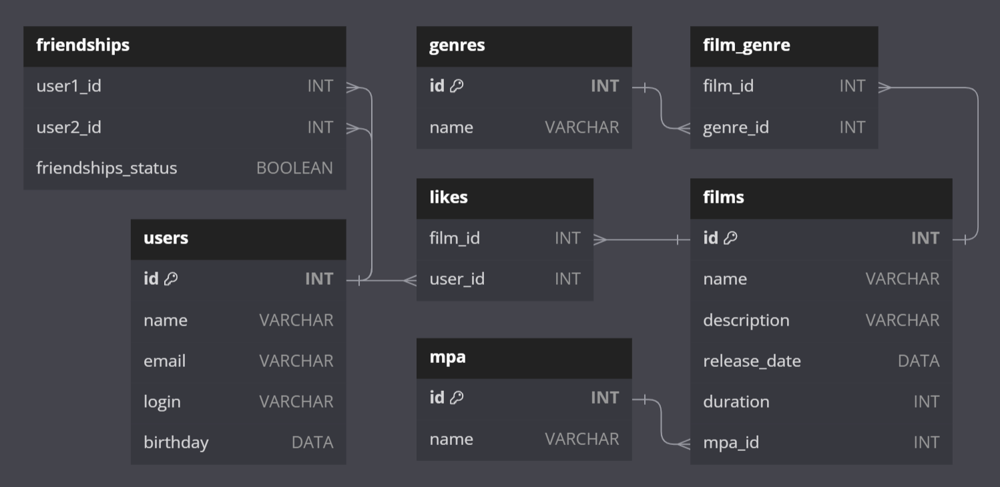

# Filmorate

**Рейтинг фильмов** — веб-сервисное монолитное приложение для управления базой данных пользователей и фильмов. Поддерживает хранение данных как в памяти, так и в базе данных.

## Основные возможности:
- **Управление пользователями:** 
  - Оздание/обновление/удаление пользователя. Получение списка всех пользователей и информации по их ID.
- **Работа с друзьями:**
  - Добавление/удаление друзей. Получение списка друзей пользователя и общих друзей двух пользователей.
- **Управление фильмами:**
  - Добавление/обновление/удаление фильма. Добавление/удаление лайков. Поиск фильмов по названию и режиссёру. Получение списка всех фильмов и информации по их ID.
- **Дополнительные функции с фильмами:**
  - Топ-N фильмов по рейтингу. Списки всех жанров и возрастных рейтингов.
- **Отзывы на фильмы:**
  - Добавление/удаление отзывов. Получение всех отзывов на фильм.

## Стек технологий

- **Java Core:**
  - JDK версии 11: Современные возможности для высокого качества и производительности кода.
- **Фреймворки:**
  - Spring Boot: Упрощает разработку и развертывание приложений.
- **Сетевое взаимодействие:**
  - REST Api: Легкость и гибкость взаимодействия между клиентом и сервером, используя контроллеры для обработки запросов в формате JSON.
- **Валидация и обработка данных:**
  - Lombok: Упрощает написание кода, генерируя часто используемые конструкции.
  - MapStruct: Упрощает маппинг данных между разными слоями приложения.
- **Базы данных:**
  - H2: Встраиваемая база данных для разработчиков.
  - JDBC: Стандартный API для взаимодействия с реляционными базами данных.
- **Тестирование:**
  - JUnit: фреймворк для модульного тестирования кода.

## ER-диаграмма базы данных

